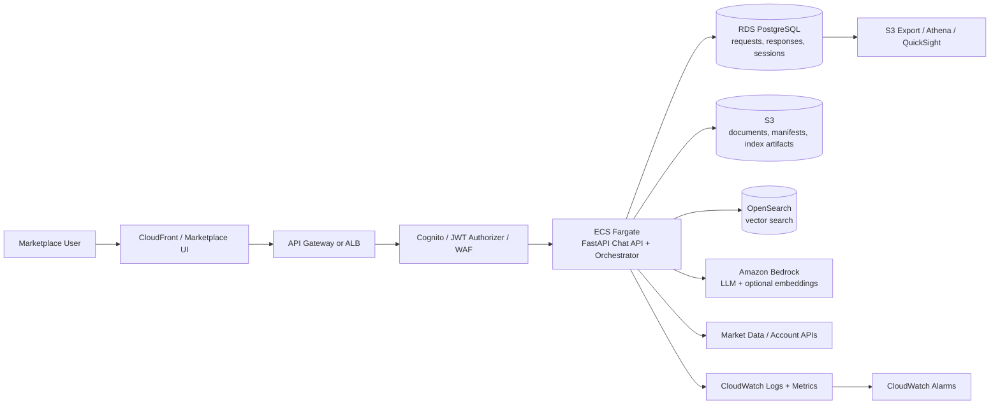
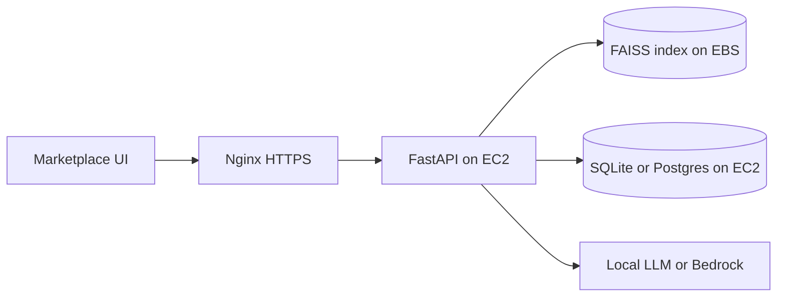
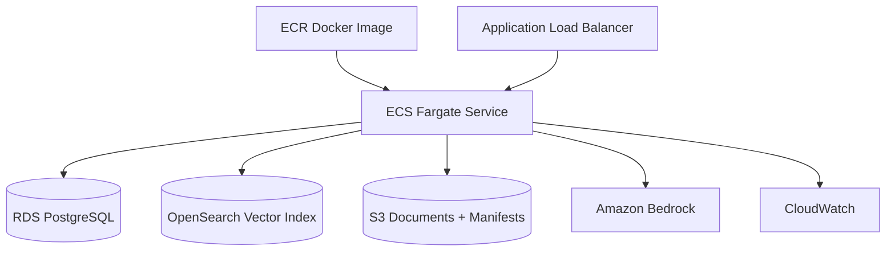

# Hosting Financial RAG on AWS

This guide maps the marketplace chat architecture to AWS services and gives two deployment paths:

- **Prototype path:** one EC2 instance running the app, local FAISS index, and optional local LLM.
- **Production path:** containerized chat API on ECS/Fargate, managed LLM through Amazon Bedrock, managed storage, logs, and analytics.

## Service Map

| Architecture Service | What It Does | AWS Service |
| --- | --- | --- |
| Marketplace UI | Chat widget or marketplace frontend | S3 + CloudFront, Amplify, or existing marketplace app |
| Chat API Gateway | Public HTTPS entry point for `/chat` | API Gateway or Application Load Balancer |
| Auth / tenant checks | Validates user, tenant, rate limits | Cognito, JWT authorizer, WAF, API Gateway throttling |
| Conversation orchestrator | Runs decision service, retrieval, prompt building, response formatting | ECS on Fargate, Lambda for light traffic, or EC2 |
| Decision service | Chooses retrieve/direct/tool/clarify/reject | Same service as orchestrator at first; split later if needed |
| Embeddings service | Converts user query and documents to vectors | Local sentence-transformers in container, SageMaker endpoint, or Bedrock embeddings |
| Vector store | Stores and searches document vectors | OpenSearch vector search, Aurora PostgreSQL with pgvector, or local FAISS on EFS/EBS |
| Index registry | Stores index manifests and metadata | S3, DynamoDB, or Postgres |
| LLM generation | Generates final answer from context | Amazon Bedrock, SageMaker-hosted model, or local model on EC2/GPU |
| Request/response store | Saves messages, route, answer, citations, latency | RDS PostgreSQL or Aurora PostgreSQL |
| Raw documents | Stores scraped/source docs | S3 |
| Logs and metrics | Debugging, latency, route quality | CloudWatch Logs, CloudWatch Metrics, X-Ray |
| Offline analytics | Query analysis and evaluation data | S3 + Athena, Redshift, or QuickSight |

## Recommended Production Architecture



## What Each Service Does

### 1. Marketplace UI

The UI renders chat messages, streams responses, and displays citations. It should only call one endpoint:

```http
POST /chat
```

Hosting options:

- Use the existing marketplace frontend if you already have one.
- Use S3 + CloudFront for a static React/Vite app.
- Use AWS Amplify if you want managed frontend hosting and CI/CD.

### 2. API Gateway or Application Load Balancer

This is the public HTTPS entry point. It forwards `/chat` to the backend orchestrator.

Use:

- **API Gateway** if you want request throttling, authorizers, and a serverless API edge.
- **Application Load Balancer** if your backend is ECS/Fargate and you want simpler long-running HTTP/streaming behavior.

For streaming chat responses, ALB + ECS is often simpler.

### 3. Auth, Tenant, and Guardrails

This layer verifies who is asking and which marketplace tenant they belong to.

Use:

- Cognito or your existing JWT provider for authentication.
- AWS WAF for basic request protection.
- API Gateway throttling or app-level throttling for rate limits.
- Tenant ID checks inside the orchestrator before loading indexes or documents.

### 4. Chat API and Orchestrator

This is the main backend service. Start with the sample in `chat_orchestrator.py`.

Responsibilities:

- Accept request from UI.
- Store incoming request.
- Run decision service.
- If needed, route to the right index.
- Retrieve vector chunks.
- Call LLM.
- Format response with citations and disclaimers.
- Store final response and metadata.

Recommended hosting:

- **ECS on Fargate** for production.
- **EC2** for prototype.
- **Lambda** only if dependencies stay small and requests are short. Sentence-transformers and FAISS can make Lambda packaging/cold starts awkward.

### 5. Decision Service

The decision service decides where a request goes:

- `retrieve`: use vector search and grounded context.
- `direct_answer`: no vector search.
- `tool_call`: market/account/calculator API.
- `clarify`: ask a follow-up.
- `reject`: unsafe or unsupported request.

Start by keeping this inside the orchestrator. Split it into a separate ECS service only if it grows into its own model, rules engine, or evaluation lifecycle.

### 6. Vector Store

Prototype:

- Use local FAISS stored on EC2 EBS.
- Good for a single server and small indexes.

Production:

- Use **Amazon OpenSearch Service vector search** for managed k-NN vector retrieval.
- Use **Aurora/RDS PostgreSQL with pgvector** if you want relational metadata and vector search together.
- Use FAISS on EFS/EBS only if you are comfortable managing index files yourself.

The current repo can keep FAISS locally while you prototype. Later, replace `vector_store.py` with an OpenSearch-backed implementation while keeping the orchestrator contract the same.

### 7. Index Registry and Manifests

The index registry tells the router which indexes exist and what each one is good for.

Prototype:

- Keep `indexes/<index_name>/index_manifest.json` on disk.

Production:

- Store manifests in S3 or DynamoDB.
- Keep index metadata in Postgres if you need tenant-level visibility, versioning, and approvals.

Recommended manifest fields:

```json
{
  "name": "investopedia_concepts",
  "description": "Financial education concepts and definitions",
  "tags": ["finance", "definitions", "investing"],
  "use_cases": ["concept explanation", "financial education"],
  "tenant_ids": ["marketplace_a"],
  "backend": "opensearch",
  "index_name": "financial-rag-investopedia-v1",
  "model_name": "all-MiniLM-L6-v2",
  "embedding_dim": 384,
  "version": "2026-05-26"
}
```

### 8. LLM Provider

Recommended production option:

- Use **Amazon Bedrock** for managed LLM calls. Bedrock exposes foundation models through an API, so you avoid hosting GPUs and model servers yourself.

Other options:

- Use SageMaker endpoint if you need to host your own model.
- Use EC2 GPU if you want full control and accept the operations burden.
- Use local `llama.cpp` only for prototype or private offline deployments.

### 9. Request and Response Storage

Do not keep SQLite for production. Move the `chat_orchestrator.py` storage schema to RDS PostgreSQL.

Recommended table:

```sql
CREATE TABLE chat_interactions (
    id BIGSERIAL PRIMARY KEY,
    conversation_id TEXT NOT NULL,
    tenant_id TEXT NOT NULL,
    user_id TEXT,
    user_message TEXT NOT NULL,
    route TEXT NOT NULL,
    intent TEXT NOT NULL,
    selected_index TEXT,
    retrieved_sources_json JSONB NOT NULL DEFAULT '[]',
    prompt TEXT,
    answer TEXT NOT NULL,
    latency_ms INTEGER NOT NULL,
    decision_json JSONB NOT NULL,
    feedback_score INTEGER,
    created_at TIMESTAMPTZ NOT NULL DEFAULT now()
);

CREATE INDEX idx_chat_interactions_conversation
ON chat_interactions (conversation_id, created_at);

CREATE INDEX idx_chat_interactions_tenant_route
ON chat_interactions (tenant_id, route, created_at);
```

Use this data for:

- Most common user questions.
- Which routes are selected.
- Retrieval hit quality.
- Queries with low confidence.
- Slow requests.
- Answers with negative user feedback.
- Evaluation datasets for future router improvements.

Privacy note: storing full prompts and answers can be sensitive. For regulated or enterprise tenants, store redacted text, encrypted columns, or sampled records.

### 10. Raw Documents and Index Build Pipeline

Use S3 as the source of truth for documents:

```text
s3://financial-rag-documents/raw/
s3://financial-rag-documents/processed/
s3://financial-rag-documents/index-artifacts/
```

Index build options:

- ECS scheduled task for batch index builds.
- AWS Batch for large indexing jobs.
- Step Functions if you want a visible multi-step pipeline: scrape -> clean -> chunk -> embed -> index -> publish manifest.

### 11. Observability

Send logs from the orchestrator to CloudWatch.

Log these fields per request:

- `conversation_id`
- `tenant_id`
- `route`
- `intent`
- `selected_index`
- `top_similarity`
- `retrieved_count`
- `llm_model`
- `latency_ms`
- `error_type`

Create CloudWatch alarms for:

- API 5xx rate.
- High latency.
- Bedrock throttling/errors.
- OpenSearch errors.
- RDS connection errors.

## Deployment Path 1: Simple EC2 Prototype

Use this when you want to prove the flow with the least moving parts.



Instance guidance:

- Basic retrieval only: `t3.large` or `t4g.large`, 8-16 GB RAM.
- Local LLM CPU: `c6i.xlarge` or larger.
- Local LLM GPU: `g5.xlarge` or larger.

Setup:

```bash
sudo apt update
sudo apt install -y python3 python3-venv python3-pip git build-essential nginx
git clone <your-repo-url> financial-rag
cd financial-rag
python3 -m venv .venv
source .venv/bin/activate
pip install --upgrade pip
pip install -r requirements.txt
```

Run local test:

```bash
python chat_orchestrator.py --message "What is equity?"
```

For a real API, add FastAPI dependencies:

```bash
pip install fastapi uvicorn gunicorn
```

Then run your API behind `systemd` and Nginx.

Good for:

- Demos.
- Internal testing.
- Small traffic.
- Fast iteration.

Limitations:

- Scaling is manual.
- Local disk indexes need careful backups.
- SQLite is not production-grade for multi-instance API traffic.

## Deployment Path 2: Production ECS/Fargate

Use this when marketplace users will depend on the chat service.



Build and host the app as a Docker container:

```dockerfile
FROM python:3.11-slim

WORKDIR /app

RUN apt-get update && apt-get install -y build-essential && rm -rf /var/lib/apt/lists/*

COPY requirements.txt .
RUN pip install --no-cache-dir -r requirements.txt
RUN pip install --no-cache-dir fastapi uvicorn gunicorn psycopg[binary] boto3

COPY . .

CMD ["gunicorn", "-k", "uvicorn.workers.UvicornWorker", "api:app", "--bind", "0.0.0.0:8080"]
```

Production service setup:

1. Push image to ECR.
2. Create ECS cluster.
3. Create Fargate task definition.
4. Add environment variables for RDS, OpenSearch, S3 bucket, and Bedrock model ID.
5. Attach IAM task role with least privilege.
6. Put ECS service behind an ALB.
7. Enable CloudWatch logs.
8. Configure autoscaling on CPU, memory, or request count.

Recommended environment variables:

```text
APP_ENV=production
AWS_REGION=us-east-1
INDEX_REGISTRY_BUCKET=financial-rag-indexes
RDS_SECRET_ARN=arn:aws:secretsmanager:...
OPENSEARCH_ENDPOINT=https://...
BEDROCK_MODEL_ID=...
REQUEST_LOGGING_ENABLED=true
```

## IAM Permissions

The ECS task role should have only what the service needs:

- Read index manifests and documents from S3.
- Read database credentials from Secrets Manager.
- Connect to RDS.
- Query OpenSearch.
- Invoke selected Bedrock models.
- Write CloudWatch logs.

Avoid using broad administrator policies for the application task.

## Network Layout

Recommended VPC layout:

- Public subnets: ALB only.
- Private subnets: ECS tasks, RDS, OpenSearch.
- NAT Gateway: outbound access for ECS if needed.
- Security groups:
  - ALB allows HTTPS from internet.
  - ECS allows traffic only from ALB.
  - RDS allows traffic only from ECS.
  - OpenSearch allows traffic only from ECS.

## Migration Plan from Current Repo

1. Keep `chat_orchestrator.py` as the core application flow.
2. Add a FastAPI `api.py` with `POST /chat`.
3. Replace SQLite `InteractionStore` with Postgres.
4. Keep local FAISS for prototype; later add `OpenSearchVectorStore`.
5. Move index manifests to S3 or Postgres.
6. Replace local LLM call with Bedrock.
7. Add CloudWatch structured logs.
8. Add deployment packaging with Docker + ECS.

## Recommended First Milestone

Build this first:

```text
Marketplace UI -> ALB -> ECS/Fargate FastAPI -> local FAISS index packaged or mounted -> Bedrock -> RDS PostgreSQL
```

Then evolve to:

```text
Marketplace UI -> ALB -> ECS/Fargate FastAPI -> OpenSearch vector search -> Bedrock -> RDS PostgreSQL -> S3/Athena analytics
```

The first milestone proves the product flow. The second milestone makes retrieval and analytics easier to scale.
