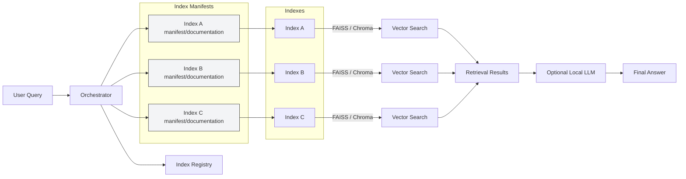

# Multi-Index RAG Framework Diagram

```mermaid
flowchart LR
    U[User Query] --> O[Orchestrator]
    O --> R[Index Registry]
    subgraph Index Manifests
        M1[Index A manifest/documentation]
        M2[Index B manifest/documentation]
        M3[Index C manifest/documentation]
    end
    O --> M1
    O --> M2
    O --> M3

    subgraph Indexes
        A[Index A]
        B[Index B]
        C[Index C]
    end

    M1 --> A
    M2 --> B
    M3 --> C

    A -->|FAISS / Chroma| VA[Vector Search]
    B -->|FAISS / Chroma| VB[Vector Search]
    C -->|FAISS / Chroma| VC[Vector Search]

    VA --> RQ[Retrieval Results]
    VB --> RQ
    VC --> RQ

    RQ --> LLM[Optional Local LLM]
    LLM --> Answer[Final Answer]

    classDef title fill:#f3f4f6,stroke:#333,stroke-width:1px;
    class M1,M2,M3 title;
```