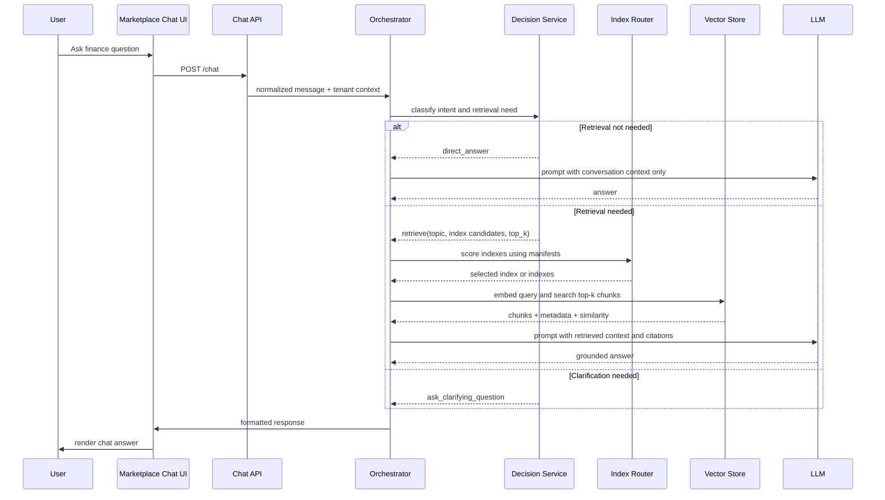
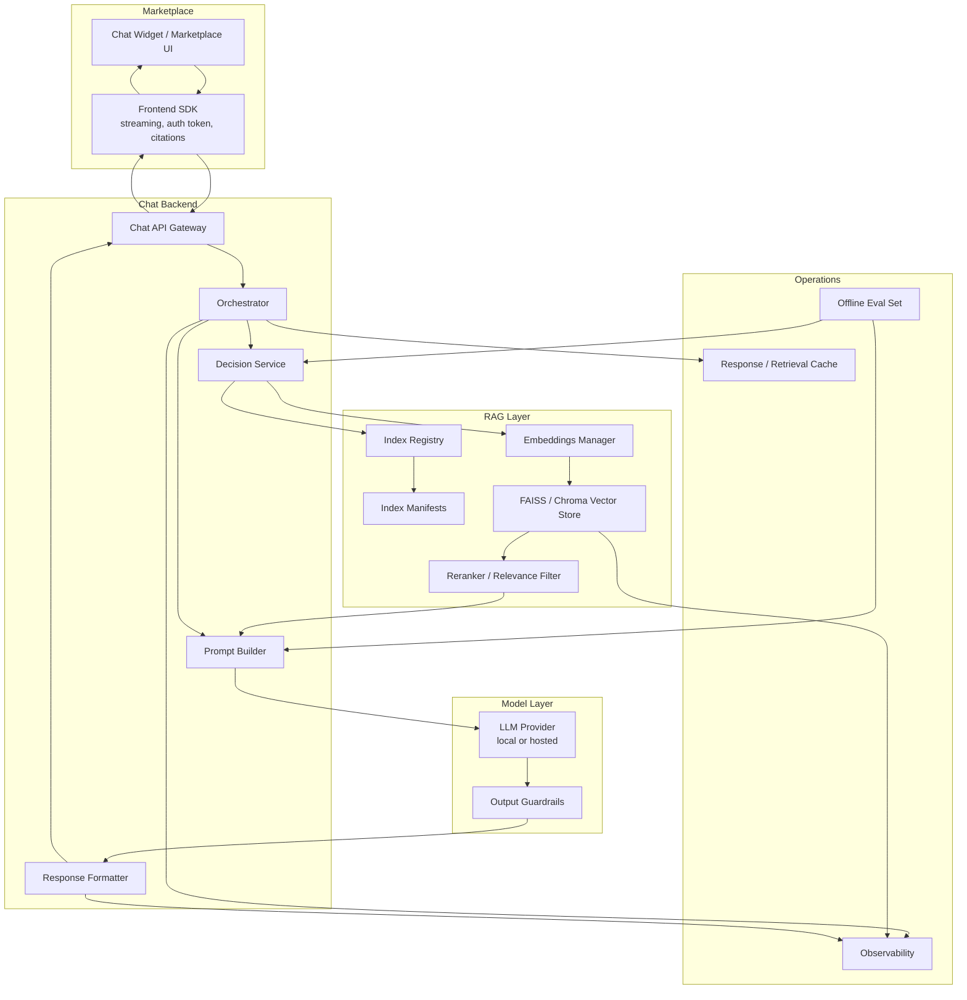
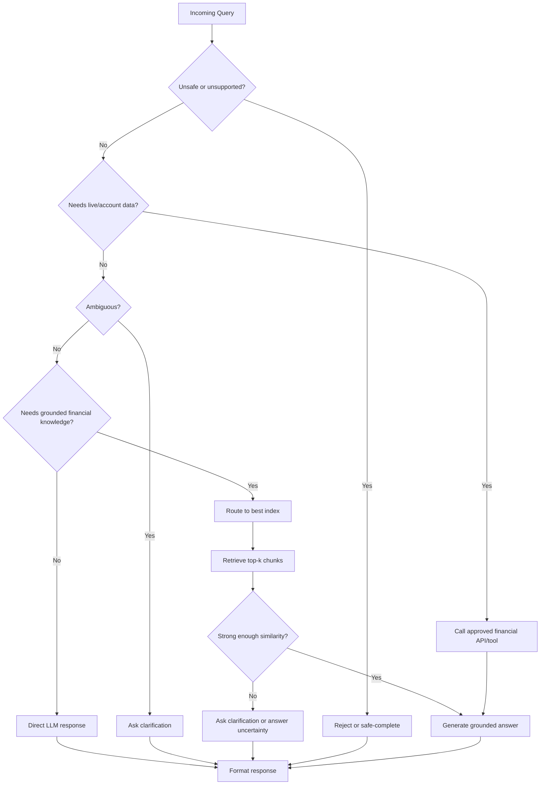

# Marketplace Chat Architecture for Financial RAG

This architecture exposes the financial RAG service through a marketplace chat UI while keeping retrieval optional. The orchestration layer decides whether a request needs vector context, a deterministic service, clarification, or a direct LLM response.

## High-Level Architecture

```mermaid
flowchart LR
    U[Marketplace User] --> UI[Marketplace Chat UI]
    UI --> API[Chat API Gateway]

    API --> AUTH[Auth, Tenant, Rate Limit]
    AUTH --> SAFE[Input Guardrails<br/>PII, abuse, prompt-injection scan]
    SAFE --> ORCH[Conversation Orchestrator]

    ORCH --> MEM[Session Memory<br/>chat history, user profile]
    ORCH --> DECIDE[Decision Service<br/>intent, topic, risk, retrieval need]

    DECIDE -->|Needs clarification| CLARIFY[Ask Follow-up Question]
    CLARIFY --> UI

    DECIDE -->|General chat / small talk| DIRECT[Direct LLM Answer]
    DIRECT --> FORMAT[Response Formatter]

    DECIDE -->|Known deterministic action| TOOLS[Financial Tools / APIs<br/>pricing, calculators, account data]
    TOOLS --> TOOLCTX[Tool Result Context]
    TOOLCTX --> LLM[LLM Response Generator]

    DECIDE -->|Financial knowledge needed| ROUTER[Index Router]
    ROUTER --> REG[Index Registry<br/>index_manifest.json files]

    subgraph Financial Knowledge Indexes
        I1[Investopedia Concepts Index]
        I2[Filings / Reports Index]
        I3[Marketplace FAQ Index]
        I4[Policy / Compliance Index]
    end

    REG --> ROUTER
    ROUTER -->|select index or indexes| RETRIEVE[Vector Retrieval<br/>FAISS / Chroma top-k]
    RETRIEVE --> RERANK[Rerank + Threshold Filter]
    RERANK --> CTX[Grounding Context<br/>chunks, sources, similarity]
    CTX --> LLM

    MEM --> LLM
    ORCH --> LLM
    LLM --> FORMAT
    FORMAT --> CITED[Final Chat Response<br/>answer, citations, disclaimers]
    CITED --> UI

    ORCH --> OBS[Logs, Metrics, Traces<br/>route, latency, retrieval hits]
    LLM --> OBS
    RETRIEVE --> OBS
```



## Runtime Flow



## Decision Service

The decision service should run before vector retrieval. It can be implemented as a small policy engine, a lightweight classifier, or an LLM router with strict JSON output.

Recommended routing outputs:

```json
{
  "route": "retrieve | direct_answer | tool_call | clarify | reject",
  "intent": "definition | comparison | calculation | market_data | account_help | small_talk | unsafe",
  "topic": "equity",
  "index_candidates": ["investopedia", "filings", "marketplace_faq"],
  "needs_retrieval": true,
  "top_k": 5,
  "confidence": 0.87,
  "reason": "User asks for a finance concept definition that should be grounded in indexed content."
}
```

Use vector retrieval when the user asks for:

- Financial concept explanations, such as equity, ROE, ETFs, bonds, liquidity, valuation, or risk.
- Questions requiring source-backed answers from indexed content.
- Marketplace policy, FAQ, compliance, or product documentation.
- Company filings, reports, or other indexed documents.

Skip vector retrieval when the user asks for:

- Greeting, small talk, or conversational follow-up that can be answered from chat memory.
- Formatting, summarization, or rewriting of text already provided in the chat.
- Deterministic calculations where a calculator/tool is more reliable than RAG.
- Live market prices or account-specific information, which should go to tools/APIs instead of static vectors.
- Ambiguous questions where the system should ask a follow-up before retrieving.

## Core Services



## API Shape

The marketplace UI only needs to know about the chat contract. The backend hides whether the answer came from direct LLM generation, tool calls, or vector retrieval.

```http
POST /chat
Content-Type: application/json

{
  "conversation_id": "conv_123",
  "tenant_id": "marketplace_a",
  "message": "What is equity and how do I calculate it?",
  "stream": true
}
```

Example response payload:

```json
{
  "conversation_id": "conv_123",
  "route": "retrieve",
  "answer": "Equity is the residual value of an asset after liabilities are subtracted...",
  "citations": [
    {
      "source": "investopedia-www-investopedia-com-terms-e-equity-asp.txt",
      "chunk_id": 2,
      "similarity": 0.82
    }
  ],
  "disclaimer": "This is educational information, not financial advice."
}
```

## Implementation Mapping to This Repo

- `orchestrator.py`: extend into the chat orchestrator. It already scores index manifests and routes to the best index.
- `index_registry.py`: keep as the registry for available indexes and their manifests.
- `vector_store.py`: keep as the vector abstraction for FAISS or Chroma retrieval.
- `query_rag.py`: reuse prompt construction and LLM generation, but move printing concerns behind an API-friendly return object.
- `indexes/*/index_manifest.json`: add strong descriptions, tags, use cases, tenant visibility, and freshness metadata so routing is reliable.
- `indexes/*/metadata.json`: continue storing chunk source, chunk id, text, and optional chunk hashes for citation support.

## Suggested Decision Logic



## Production Notes

- Add a confidence threshold after index routing and after vector search. Low confidence should trigger clarification or a cautious answer.
- Include source metadata in the LLM prompt and response so the marketplace UI can render citations.
- Keep financial disclaimers in the response formatter, not scattered across prompts.
- Log the selected route, selected index, similarity scores, latency, and whether citations were returned.
- Add evaluation cases for queries that should not retrieve, such as greetings, calculations, live market data, and ambiguous questions.
